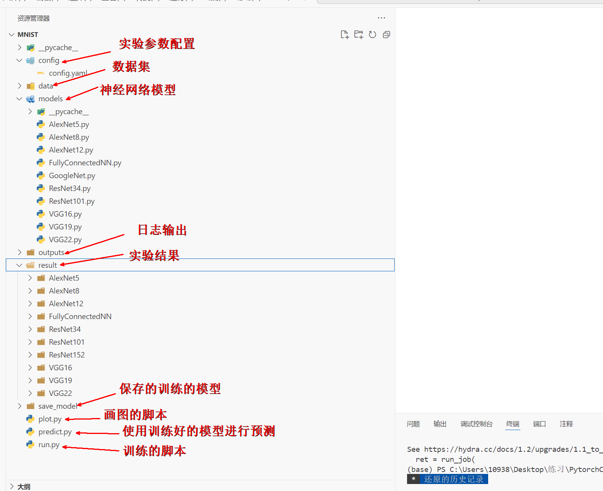
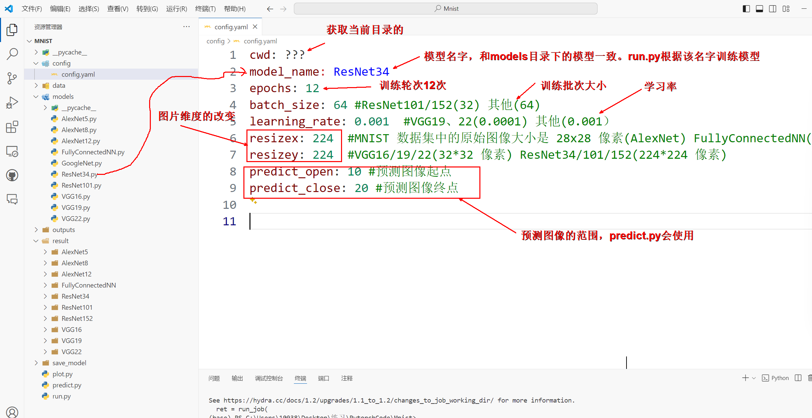

# 手写数字识别实验（AlexNet、VGG、ResNet）

## 1. 目录的基本作用

## 2. config.yaml（参数配置文件）的说明

---

## 3. 参考链接

1. [PyTorch实现的ResNet50、ResNet101和ResNet152](https://blog.csdn.net/shanglianlm/article/details/86376627)
2. [VGG11、VGG13、VGG16、VGG19网络结构图](https://blog.csdn.net/weixin_43917574/article/details/113327681)
3. [AlexNet8详细原理](https://blog.csdn.net/Code_and516/article/details/129812727)
4. [经典卷积神经网络-VGG原理](https://blog.csdn.net/panghuzhenbang/article/details/124431562)
5. [ResNet-34](https://blog.csdn.net/HoraceYan/article/details/125824999)
